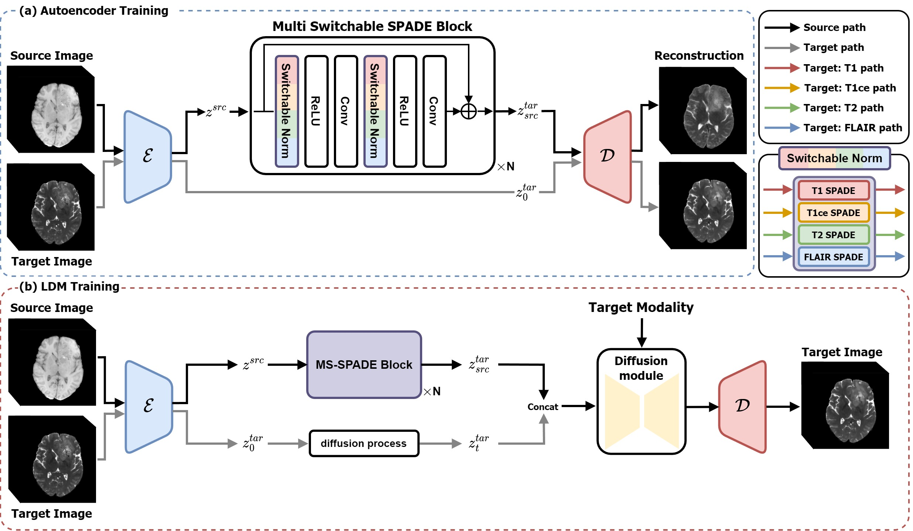

# Paper
Adaptive Latent Diffusion Model for 3D Medical Image to Image Translation: Multi-modal Magnetic Resonance Imaging Study [Jonghun Kim], [Hyunjin Park] <br>
Department of Electrical and Computer Engineering Sungkyunkwan University, Suwon, Korea <br>
WACV 2024 [[paper]](https://openaccess.thecvf.com/content/WACV2024/html/Kim_Adaptive_Latent_Diffusion_Model_for_3D_Medical_Image_to_Image_WACV_2024_paper.html) [[arxiv]](https://arxiv.org/abs/2311.00265)<br>


# Overview

This repository contains the code for Adaptive Latent Diffusion Model for 3D Medical Image to Image Translation: Multi-modal Magnetic Resonance Imaging Study. The model architecture is illustrated below: 





Our code was written by applying SPADE, VQ-GAN, and LDM into 3D methods. We would like to thank those who have shared their code. Thanks to everyone who contributed code and models.

- [Taming Transformers for High-Resolution Image Synthesis](https://github.com/CompVis/taming-transformers) 
- [Semantic Image Synthesis with SPADE](https://github.com/NVlabs/SPADE)
- [Latent Diffusion Models](https://github.com/CompVis/latent-diffusion)


Our work proceeds in two steps, and each repository contains explanations on the training and inference methods. Please refer to them for more information.


# Datasets

We utilized the multi-modal brain tumor segmentation challenge 2021(BraTS 2021) and Information eXtraction From Images (IXI) dataset. Accessible links are provided below. 

BraTS 2021: https://www.synapse.org/#!Synapse:syn25829067/wiki/610863 

IXI: https://brain-development.org/ixi-dataset/ 


# Citation

```bibtex
@InProceedings{Kim_2024_WACV,
    author    = {Kim, Jonghun and Park, Hyunjin},
    title     = {Adaptive Latent Diffusion Model for 3D Medical Image to Image Translation: Multi-Modal Magnetic Resonance Imaging Study},
    booktitle = {Proceedings of the IEEE/CVF Winter Conference on Applications of Computer Vision (WACV)},
    month     = {January},
    year      = {2024},
    pages     = {7604-7613}
}
```


